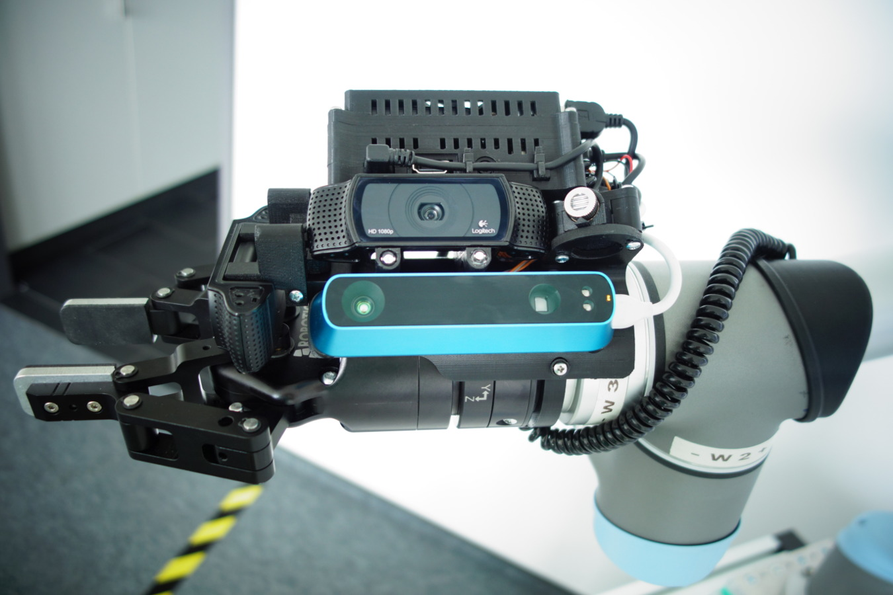
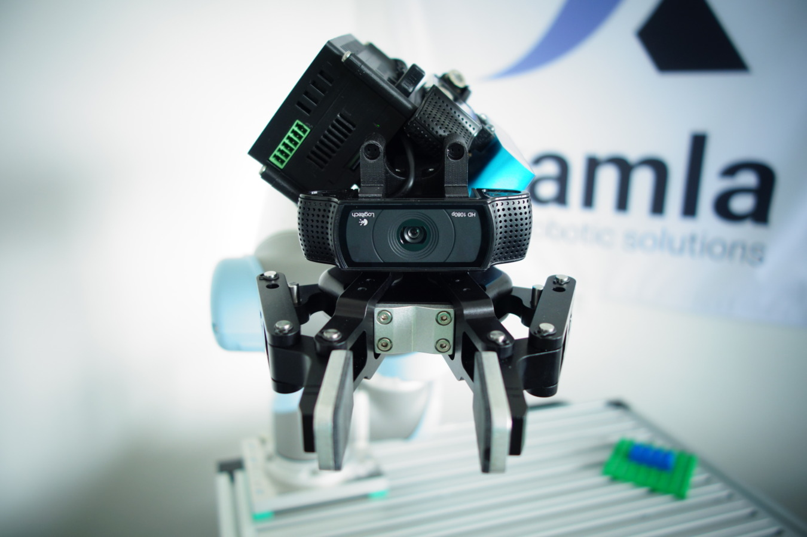

# xamla_egomo

### What is Xamla Egomo?

Egomo is an open-source research sensor head developed at [Xamla](http://www.xamla.com/) for adaptive robotics research on a [Universal Robot UR5](http://www.universal-robots.com/) equipped with [Robotiq](http://robotiq.com/) end-of-arm technology. It acts as a low-cost, 3D-printable reference smart-sensor device for our [ROSvita](http://www.xamla.com/rosvita/) Robot Programming IDE (to be released in 2017). 
For more information and product pictures visit the [egomo website](http://xamla.com/egomo). Watch our robot [stacking duplos](https://www.youtube.com/watch?v=uo04vuXcwlw) using the Egomo sensor head.

### Unique Features of Xamla Egomo

* 2D+3D: full featured sensor head for RGB-D scans (RGB+Depth side cams) and visual servoing tasks (front-cam)
* NO CABLES: wireless connection of sensors and gripper!
* ROS: all sensors + actuators exposed as ROS nodes
* EASY: Lua client library to move robot and capture images + examples
* sensor-board with additional IO ports for laser, high-power IR/white LEDs or simple grippers or tactive sensors
* two side- and front view Logitech C920 cameras in combinaton with a structure IO depth sensor
* option to directy connect a Robotiq 2-Finger-Gripper-85 + Robotiq FT-300 sensor 
* Easily usable from the Torch7 machine-learning framework (e.g. for deep learning based object detection or advanced RL-experiments)

### Xamla Egomo sensor head ROS Package ###

This package is based on [LUA](https://www.lua.org/) with [Torch](https://github.com/torch) and the wrappers
[torch-ros](https://github.com/Xamla/torch-ros),  [torch-pcl](https://github.com/Xamla/torch-pcl)  and [torch-opencv](https://github.com/VisionLabs/torch-opencv).

This packages contains the following:

  * [xamla_egomo](/xamla_egomo) Metapackages
  * [egomo_msgs](/egomo_msgs): Messages, Services, Actions in order to talk to Gripper, Force-Torque Sensor, RGB-Camera, Depth-Camera, Laser, LED
  * [egomo_node](/egomo_node): LUA node which is responsible for the communication with any parts connected to the IO-Board (e.g. Gripper, Force-Torque, LED)
  * [egomo_ur5](/egomo_ur5): Contains URDF Robot description of the UR5 equipped with Egomo sensor head as well as launches for e.g. gazebo.
  * [egomo_webcam](/egomo_webcam): Contains ros-node for the Logitech C920 Webcam.
  * [egomo_depthcam](/egomo_depthcam): Contains ros-node for the Strucure-IO sensor.
  * [egomo_3d_printed_parts](/egomo_3d_printed_parts): CAD files for printing the case of the Egomo sensor head.
  * [egomo_demos](/egomo_demos): Demos based on LUA (like pick and place objects).
  * [egomo_tools](/egomo_tools): Libraries offering easy to use interfaces for e.g. Gripper control.
  * [egomo_pi_image](/egomo_pi_image): Link and description of the Raspberry PI containing everything to need with an read-only file system.

### Calibration ###

We do offer an implemented calibration routine on [request](http://xamla.com/en/contact/index.html) as well as CAD-Files when you would like to adapt the sensor head for another robot. In 2017 we plan to offer you [ROSVITA](http://xamla.com/en/rosvita/index.html) which brings a lot of features such as a professional calibration (including full robot calibration).

### Get a pre-assembled Egomo device from us

You like the idea of open-source hardware but the process of buying parts, 3D printing, soldering etc. is too cumbersome and time-intensive for you and you would like to get a tested/working sensor head quickly?  
We offer a pre-assembled version of the Egomo sensor head with all parts installed and tested (good quality 3D printed parts made from ABS Ultrat, 2x Logitech C920 Web-Cam, 3x white LED, 1x IR LED, Structure IO, RPi 3, Xamla IO-Board,  shortened cables, our customized RPi operating system on a 16 GB class 10 microSD card and a 20mW 830nm IR line laser (depending on your country's import restrictions)) for EUR 1499 + shipping. If you are interested in this option please contact us via [E-mail](mailto:egomo@xamla.com).

### Support / Contact ###

If you have any troubles please let us know by creating an Issue. Do not hesitate to contact us via [E-mail](mailto:egomo@xamla.com) for questions, feedback and suggestions. We look forward to hear from you!  

Follow [@xamla on Twitter](https://twitter.com/xamla) and [subscribe](http://xamla.com/en/egomo) to our newsletter. 
