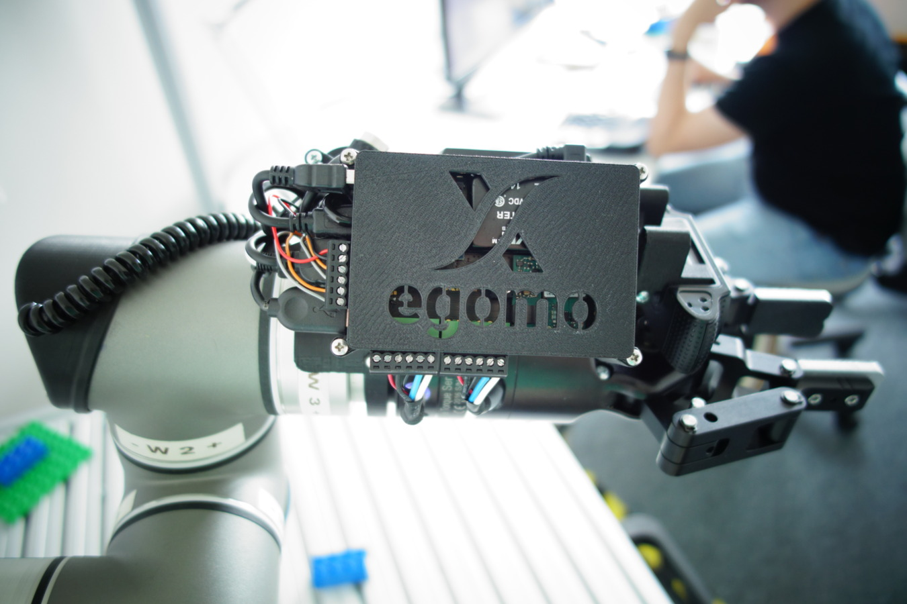
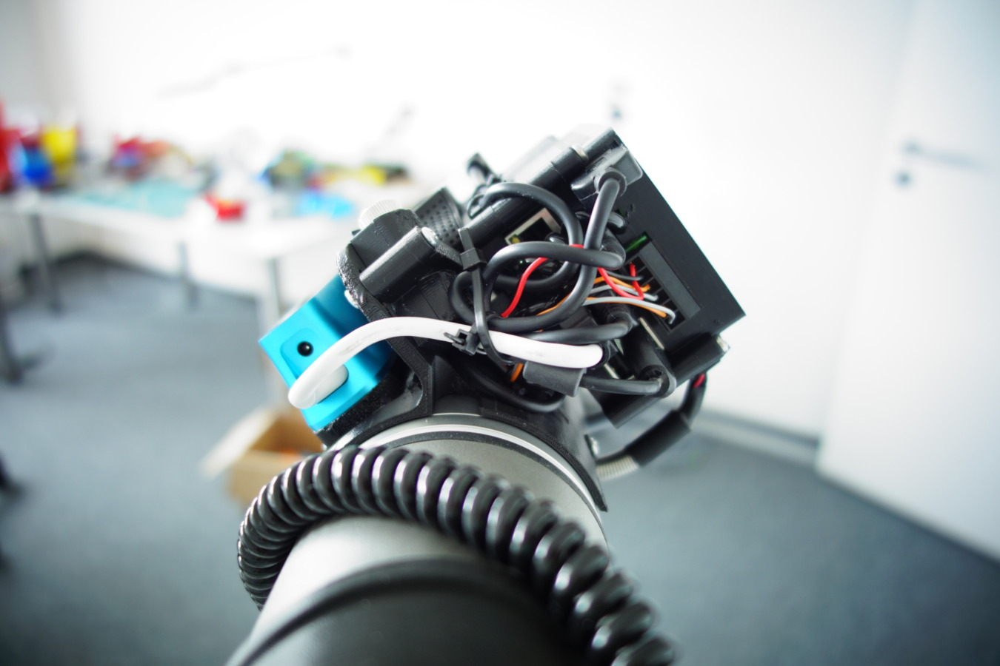
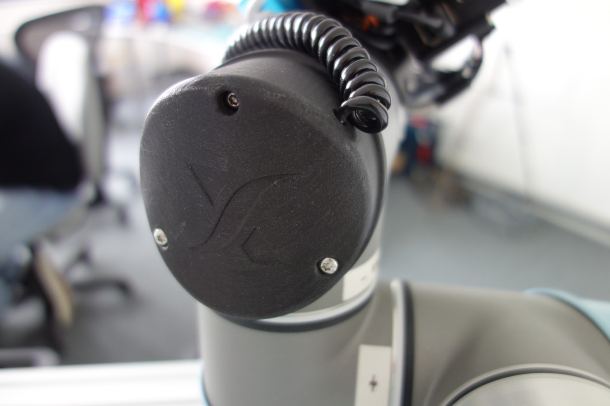

# STL files for 3D printing of Egomo-1

## Product Pictures

We took some photos to give you an impression how the finished sensor head looks when it is mounted on a UR5.

## 	Multi-use Options

There are many ways to use the Egomo 3D models for your robotic research experiments:

Here are some ideas:

1. Obviously you can build the full-featured Xamla Egomo-1 sensor head, optionally with or without RPi enclosure or front-camarea mount.
2. Just use the coupling + base plate as a camera mount (conventionally cabled).
3. Use the RPi+IO-Board enclosure stand-alone as remote ROS sensor-node or smart camera (e.g. to monitor the roboter scene from a fixed mounted RGB-D camera). 

## Parts

The Egomo-1 sensor head consinsts of the following parts:

- coupling: xamla_mount_flange.stl 
- base-plate: xamla_mount_base.stl
- custom joint cap: xamla_cap_hole.stl
- C920 side mount: xamla_mount_c920_left.stl + xamla_mount_c920_right.stl
- Line-Laser mount: xamla_mount_laser_bottom.stl + xamla_mount_laser_top.stl
- Raspberry Pi + IO Board enclosure: xamla_mount_rpi_bottom.stl + xamla_mount_rpi_middle.stl + xamla_mount_rpi_top.stl

Additionally we publish the file xamla_cap.stl which is a simple version of our custom Xamla joint cap without a hole for the power cable. It might be useful if you just want to fix a kinematic problem (collision) of the original UR5 joint cap that prevents the robot from freely rotating in all situations.

## Adaption to other Robots

If you are a robotics researcher and you want to customize the Egomo 3D parts to your special requirements or adapt it to a different robot model we can provide you the original CAD files on request. Please get in touch with us via [E-Mail](egomo@xamla.com).

