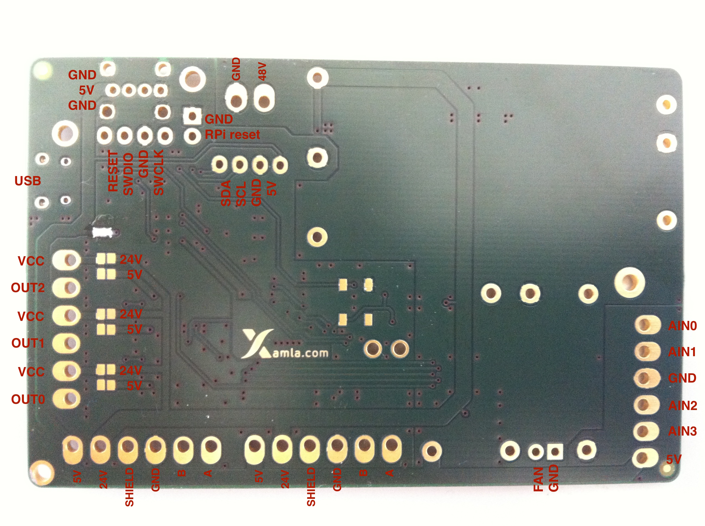

# xamla_ioboard
The Xamla IOBoard is the power supply and lowlevel IO interface of Xamla egomo.

### SPECS
- Cortex M4 CPU 72MHz
- 4x analog input 0-5V 12bit
- 3x digital output (5V 1A / 24V 1A, pwm capable)
- 6 axis IMU (MPU 6050)
- RGB LED 24bit
- 48V 1.5A input
- 5V 4A output (Sensors, RPi, ...)
- 24V 2A output (Gripper, FTS)
- USB 2.0 FS configuration port
- 2x RS485 UART max. 9Mbit/s
- 85x55mm

### PINOUT

### SCHEMATIC
[IOBoard 0.9.1 schematic](hw/io.pdf)
